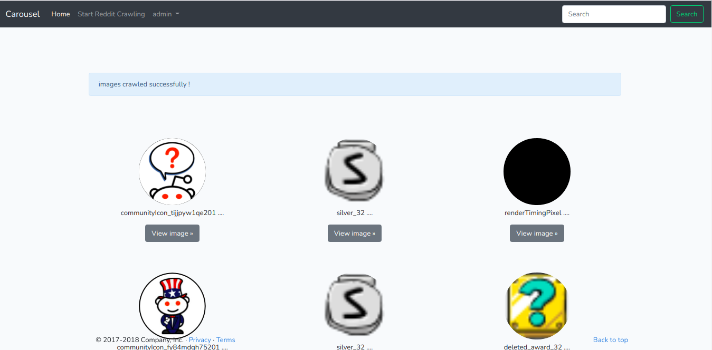

# reddit_image_test
laravel test for crawling images




``` php artisan migrate:fresh --seed ``` 

### for starting crawling reddit: enter with admin credentials and select start reddit crawling in navbar

# admin:

email: admin@demo.com 
<br>
password: password


# admin:

email: moderator@demo.com 
<br>
password: moderator
